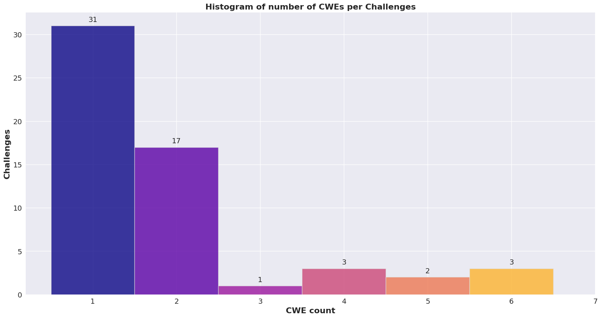
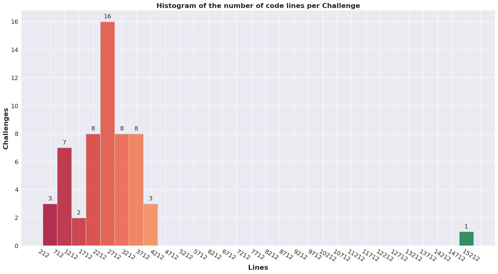
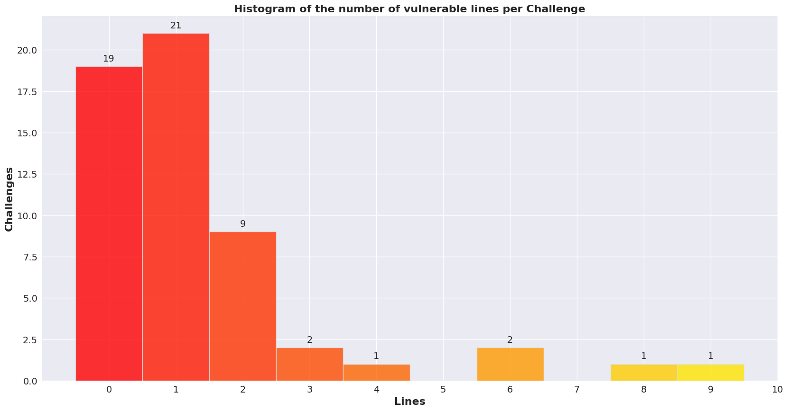
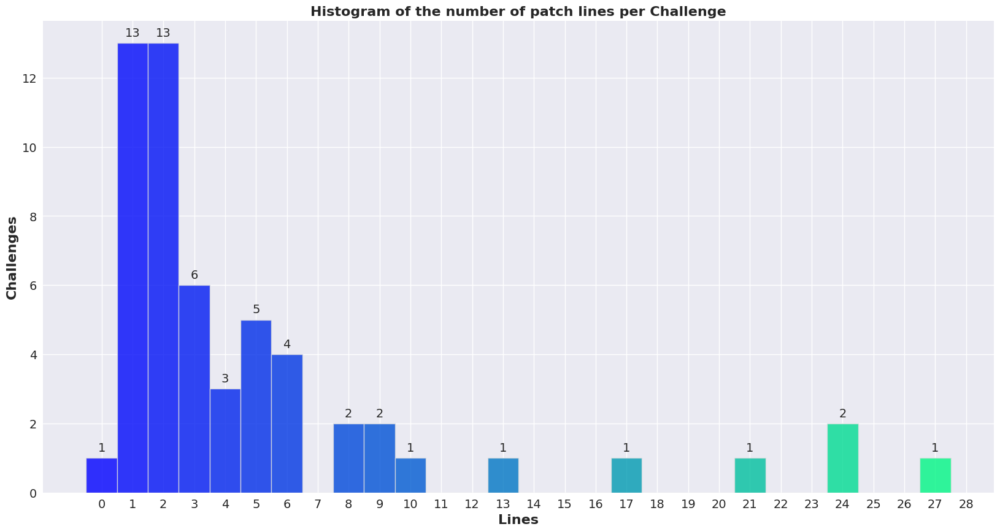
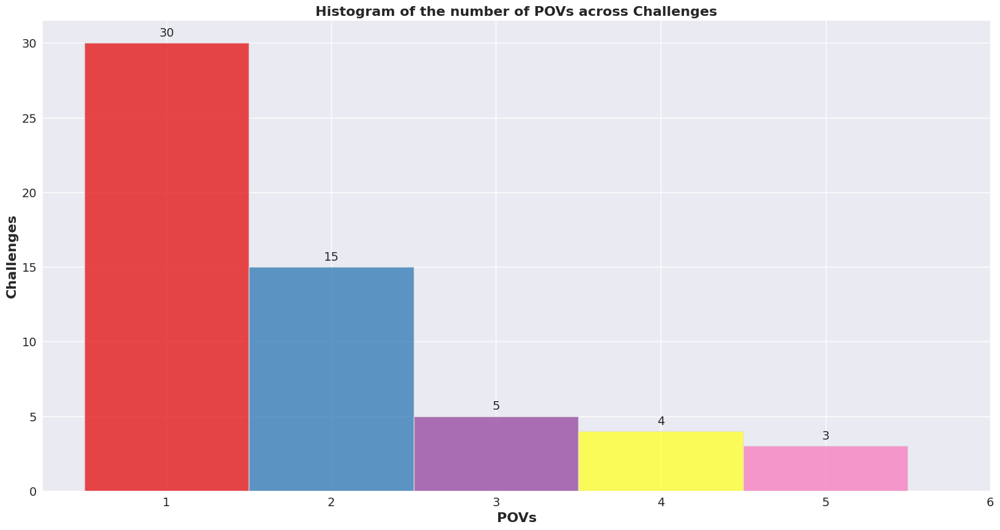

# Descriptive Statistics
For obtaining these statistics, was leveraged information from the programs that include, among others, the 
vulnerability’s description with the CWE class associated with them.
### Excluded challenges and criteria

The modified CGC Corpus by Trail of Bits contains 202 applications working on Linux. Aiming to perform and unbiased 
and controlled study, the criteria enumerated below were considered to select the candidate programs:
1. **Single file faults**: vulnerabilities must be in a single file as most repair techniques only fix a single file;
2. **Tests Initialization**: both polls and POVs ought to be compiled without errors;
3. **Sanity check**: Ascertain that the functionality is as expected, i.e., both positive and negative tests run 
  as successfully.

_____________
######Note: for some criteria (1 and 2) the programs might overlap.
_______________________

#### Multiple files
In total, 33 programs have vulnerabilities spawning across multiple files.

```
ASCII_Content_Server, Accel, BIRC, CGC_Board, CGC_Image_Parser, CGC_Planet_Markup_Language_Parser, 
COLLIDEOSCOPE, CableGrind, Childs_Game, Cromulence_All_Service, Dungeon_Master, FISHYXML, Game_Night, 
H20FlowInc, KTY_Pretty_Printer, Kaprica_Script_Interpreter, Matchmaker, Music_Store_Client, Order_Up, 
PKK_Steganography, Packet_Receiver, REMATCH_1--Hat_Trick--Morris_Worm, Rejistar, Recipe_Database, 
SCUBA_Dive_Logging, Sorter, WhackJack, cyber_blogger, greeter, pizza_ordering_system, simpleOCR, 
stack_vm, university_enrollment.
```

#### Raise error during poll generation
In total, 46 programs raise error during poll generation.

```
3D_Image_Toolkit, Carbonate, Charter, Corinth, Estadio, Lazybox, Material_Temperature_Simulation, 
Mixology, Network_File_System, Network_Queuing_Simulator, PTaaS, REMATCH_2--Mail_Server--Crackaddr, 
Recipe_and_Pantry_Manager, Water_Treatment_Facility_Simulator, payroll, Image_Compressor, RRPN, Azurad,
LazyCalc, Pattern_Finder, Snail_Mail, Venture_Calculator, Pac_for_Edges, HeartThrob, Palindrome, Tick-A-Tack, 
commerce_webscale, reallystream, HighFrequencyTradingAlgo, INSULATR, NarfAgainShell, NarfRPN, Packet_Analyzer, 
Parking_Permit_Management_System_PPMS, String_Storage_and_Retrieval, TIACA, UTF-late, Vector_Graphics_2, 
Vector_Graphics_Format, electronictrading, matrices_for_sale, simple_integer_calculator, Shipgame, Multipass2, 
Multipass3, NoHiC. 
```

#### POVs not working
In total, 57 programs have no POVs working at all.

```
BIRC, Barcoder, Bloomy_Sunday, Board_Game, CLOUDCOMPUTE, CNMP, Character_Statistics, Checkmate, 
Differ, ECM_TCM_Simulator, Enslavednode_chat, EternalPass, FASTLANE, FaceMag, Facilities_Access_Control_System, 
FailAV, Finicky_File_Folder, Flash_File_System, Fortress, GREYMATTER, Hug_Game, Kaprica_Go, Messaging, Monster_Game,
 Mount_Filemore, Multi_Arena_Pursuit_Simulator, Multi_User_Calendar, Multicast_Chat_Server, Network_File_System_v3, 
 Neural_House, OTPSim, OUTLAW, On_Sale, One_Amp, One_Vote, Order_Up, Overflow_Parking, PRU, Personal_Fitness_Manager, 
 Query_Calculator, REMATCH_1--Hat_Trick--Morris_Worm, REMATCH_3--Address_Resolution_Service--SQL_Slammer, 
 REMATCH_4--CGCRPC_Server--MS08-067, REMATCH_5--File_Explorer--LNK_Bug, REMATCH_6--Secure_Server--Heartbleed,
 Secure_Compression, Shortest_Path_Tree_Calculator, String_Info_Calculator, Terrible_Ticket_Tracker, 
 Thermal_Controller_v2, User_Manager, Virtual_Machine, WhackJack, anagram_game, middleout, tribute, vFilter.
```

#### Sanity check
In total, 16 failed sanity check.
```
BudgIT, FSK_Messaging_Service, Filesystem_Command_Shell, Grit, LMS,
Loud_Square_Instant_Messaging_Protocol_LSIMP, PCM_Message_decoder, 
SOLFEDGE, Single-Sign-On, TAINTEDLOVE, XStore, basic_emulator, chess_mimic, 
middleware_handshake, stream_vm, stream_vm2.
```


### Pie Chart with the percentage of CWEs covering the benchmark’s programs


### Histogram of the number of CWEs per Challenge


### Histogram of the total number of code lines across programs


### Histogram of the number of vulnerable code lines across programs


### Histogram of the number of patch code lines across programs


### Histogram of the number of POVs across programs


